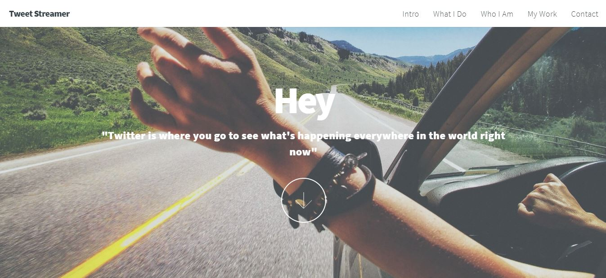
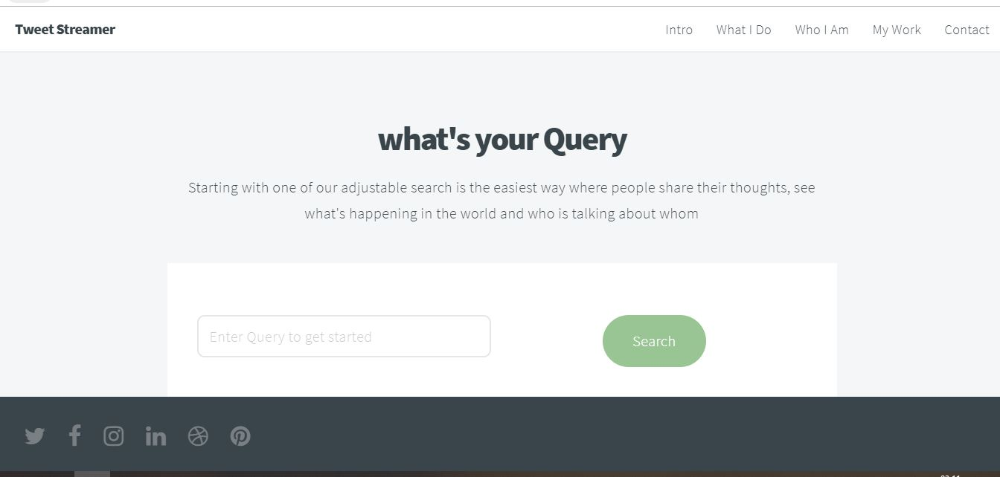
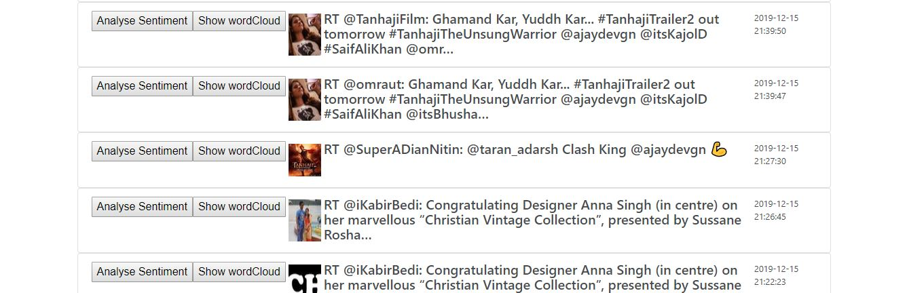
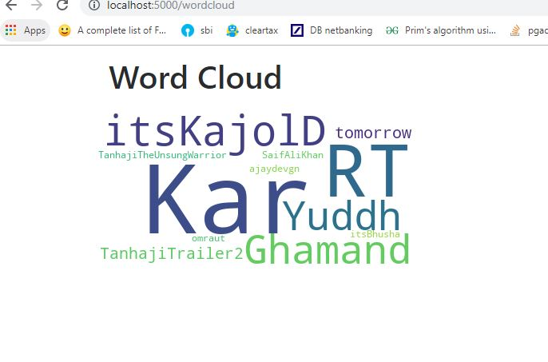
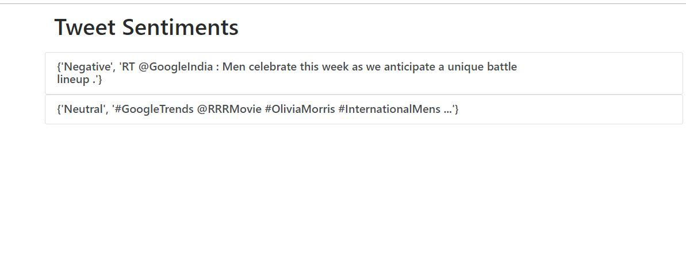

# Twitter Streamer
This is a demo web application based on python & flask. It is developed over twitter API. It has ability to stream tweets using Twitter APIs for a given hashtag or a specific twitter account.
## Table of contents
* [General info](#general-info)
* [Technologies](#technologies)
* [Code Usage](#code-usage-and-example)
* [Screenshots](#screenshots)
* [Status](#status)
* [Contact](#contact)

## General info
This project includes Twitter APIs to stream tweets for a given hashtag or a specific twitter account.Also, It analyze the sentiment of tweets.
The purpose of this project is to show how to make use of twitter API to stream and analyze tweets

## Technologies
Project is created with:
* Python
* Flask
* Jinja2
* Twitter APIs
* wordCloud
* Stanford University's Open source NLP

## Download stanford CoreNLP zip

Download via this link : https://nlp.stanford.edu/software/stanford-corenlp-full-2018-10-05.zip
unzip stanford-corenlp-full-2018-10-05.zip

Run the following commands
```
cd stanford-corenlp-full-2018-10-05
java -mx6g -cp "*" edu.stanford.nlp.pipeline.StanfordCoreNLPServer -timeout 5000
```	
## Code Usage and Example

To run this project, open command line on windows and then run following commands

```
python tweetStreamer.py
```

## Screenshots

**1. Main Page**




**2. Tweets after searching @ajaydevgn**


**3. After Clicking on Show WordCloud**



**4. After Clicking On Analyse Sentiment**




## Features
List of APIs ready are
* Get tweet using some specific user name
* Get tweet using some specific hashtag
* Get tweet using some specific Keyword
* Analyze a specific tweets 
* Draw WordCloud for a specific tweet


## Status
Project is: _in progress_

## Contact

Created by [@Shradha](https://www.linkedin.com/in/shradha-sharma-739871113/) - feel free to contact me! ;)

